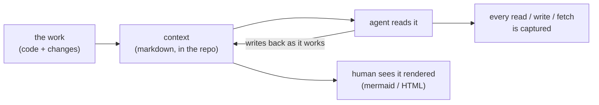
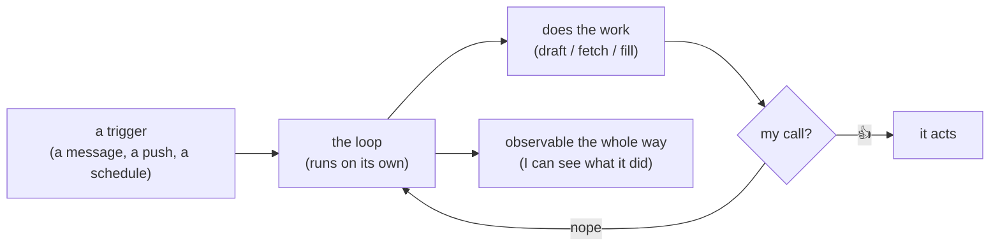

<h1 align="center">Hi, I'm Animesh 👋</h1>

  <b>ML &amp; Backend Engineer @ Deccan AI</b> 
  I build systems that run themselves — and I run my own workflow on them too.

  <i>two things I think about all day: <b>context</b> and <b>loops</b></i>

---

## 👨‍💻 About me

Early engineer (**#26**) at Deccan AI — joined at 0→1, now 200+ and Series A.
I work on high-throughput AI backends, agents, and observability. Off the clock I
build small autonomous agents that live on my own hardware and handle the boring
parts of my day.

📍 Hyderabad, India · open to remote AI-infra / backend roles

## 🧠 How I think about context

An agent is only as good as what it knows. Most teams dump knowledge in once —
a README, a wiki, a `CLAUDE.md` — and then let it rot while the code moves on.

I don't think context should be a document you maintain. It should be a document
that **maintains itself**: living where the work lives (the repo), written as
markdown so the agent can read it, rendered so a human can *see* it, and updated
as a side effect of the work actually happening. One source of truth, two
audiences, always current.

Get context right and everything downstream — agents, teammates, future-you — gets
cheaper.

## 🔁 On being a loop engineer

I'd rather design the loop than do the task. Anything I do more than twice, I want
running on its own.

But automation without a human at the decision point is just faster mistakes. So
the loops I build follow one rule: **the loop does the work, I make the call.** It
drafts, it fetches, it fills things in — then it stops, shows me, and waits. My Mac
stays on at home; I steer it from my phone; nothing ships without my 👍.

Good loops are **autonomous, observable, and interruptible.** That's the kind of
engineer I am.

## 🧰 Stack

## 🔗 Connect

 

  
  

