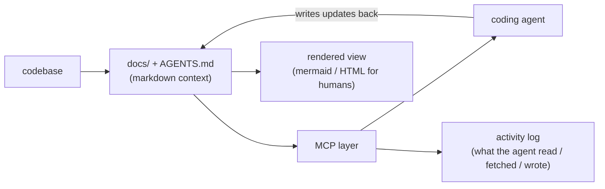
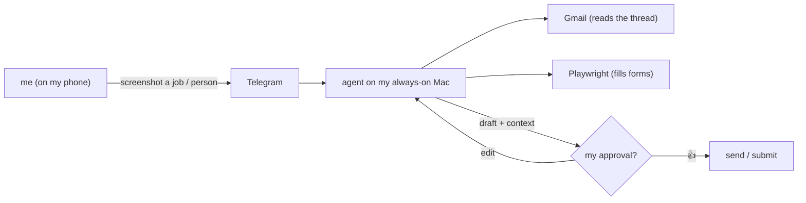

<h1 align="center">Hi, I'm Animesh 👋</h1>

  <b>ML &amp; Backend Engineer @ Deccan AI</b> 
  I build systems that run themselves — and I run my own workflow on them too.

  <i>two things I care about most: <b>context</b> (giving agents the right knowledge) and <b>loops</b> (systems that keep working without me babysitting them)</i>

---

## 👨‍💻 About me

Early engineer (**#26**) at Deccan AI — joined at 0→1, now 200+ people and Series A.
By day I build high-throughput AI backends; on the side I build small autonomous
agents that live on my own hardware and handle the boring parts of my life.

- ⚙️ backend & distributed systems · 🤖 agents · 🔁 self-running loops · 📊 observability
- 📍 Hyderabad, India · open to remote AI-infra / backend roles

## 🛠️ Stuff I've built

**Production @ Deccan AI**
- **Media Studio** — multi-modal generation backend, **2.5M+ jobs/day**, 20+ models across 5 modalities · Celery · Kafka · Redis · PostgreSQL · Prometheus + Langfuse
- **AI Interviewer** — real-time GPT-4o voice agent on LiveKit
- **Talent Intelligence** — 7-microservice resume pipeline · CDC orchestrator · BM25 + Qdrant hybrid search over **600K+ docs**

**On the side**
- **context-layer** — a living, self-managing context layer for repos (MCP-mediated `docs/`, rendered for humans, auto-updated)
- **apply-agent** — a CDP-driven form-filler that applies to jobs, with a human in the approval seat
- **[how-llms-work](https://github.com/Animeshkr9044/how-llms-work)** — ground-up notes: embeddings → attention → transformers → LLMs → MoE
- **[keka-automation](https://github.com/Animeshkr9044/keka-automation)** — auto clock-in/out via macOS `launchd` + Chrome automation

## 🧠 How I manage context

Agents are only as good as what they know. I keep context **in the repo, as markdown**,
readable by the agent and rendered for humans — and I'm building tooling
(`context-layer`) so it updates itself and never goes stale.

The principle: **one source of truth, two audiences** — the agent reads it, a human
sees it rendered, and every interaction is captured.

## 🔁 How I set up my loops

My Mac stays on at home as a little always-on server. I control it from Telegram,
and it acts through my email and the browser — but **nothing ships without my 👍**.

Human-in-the-loop by design: the agent does the paperwork, I make the call. That
line — *it drafts, I decide* — is the whole point.

## 🧰 Stack

## 🔗 Connect

 

  
  

